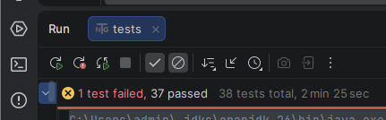

# SauceDemo QA Testing Project

This application represents a mock online shop created for testing purposes.  
Main flow is going through items in the shop, adding them to the cart and completion of purchase.
 

**APPLICATION NAME:** SauceDemo  
**APPLICATION URL:** https://www.saucedemo.com/  
**TEST ENVIRONMENT:** Production  
 
The SauceDemo application is used exclusively with predefined credentials, with no option for user 
registration or creation of additional accounts.
The available user accounts are predefined test accounts, application features, which represent different 
application behaviors, not actual users.
***

## Application Areas
1. Starting Page
2. Login
3. Header
4. Products/Inventory
5. Product details
6. Cart
7. Checkout
8. Footer  

Built in user accounts for different application behavior:
1. standard_user
2. locked_out_user
3. problem_user
4. performance_glitch_user
5. error_user
6. visual_user
***

## Technology Stack
- Windows 11 OS
- Chrome - additional browsers will be added once all application areas are completed for Chrome.  
 
- IntelliJ IDEA 2026.1
- Java 26 (Oracle OpenJDK)
- Maven, Selenium, TestNG
***

## Project Structure

### Project Content
- Manual testing documentation
- Automation framework
    - Application
    - Base
    - Pages
    - Tests
- this README file

### Terminology Used in This Project
The application opens directly on a page with a login section, although login is not its only important functionality.
Referring to this page as the "Login page" may therefore be misleading.

The term "Home page" is used inconsistently within the application and may refer either to the initial screen or to the
Products page. In addition, the Products page is accessed through the inventory.html URL.

To avoid ambiguity and ensure consistency throughout the project documentation:
- **Starting page** refers to the initial application screen.
- **Products page** refers to the page displayed after a successful login.
- The term Home page is avoided in the project documentation.

### Naming Convention
- Boolean methods are named using the is..., are or similar convention (e.g. isCartIconDisplayed(),
  isCheckoutButtonDisplayed()) to clearly indicate that they return a boolean value.
- Packages are named in camelCase with first character in lower case
- Classes are named in CamelCase with first character in upper case
- Class objects are named the same as corresponding class, but with lower case for first character
- Constants are named using UPPER_CASE with words separated by underscores.
- Constructor methods are named exactly the same as corresponding classes
- Test methods are named as corresponding test cases where applicable
- All other methods are named in camelCase with first character in lower case
***

## Test Approach
1. Each test contains at least two assertions with few exceptions where adding additional assertion would be redundant
   or were no additional assertions are possible.
2. Priorities are set with increments of 10 to allow easy addition of new tests if needed.
3. Negative login scenarios (invalid username, invalid password, invalid credentials and empty field validations) are
   covered through a data-driven TestNG DataProvider approach.
4. Chrome Password Manager and password security prompts are disabled through ChromeOptions configuration to prevent
   browser popups from interfering with automated test execution and causing false test failures.
5. Automated tests are currently executed using standard_user, which is expected to represent the application's normal 
   behavior, with no intentional bug-like behaviors. Other built-in users are or will be covered separately where applicable.
***

## Issues / Defects And Testing Notes
As no official application documentation was available, the classification was based on observed application behavior,
testing analysis and testing approach.
### BUG 001 – Reset App State does not immediately update all related UI elements
Based on testing results, this behavior was classified as a defect rather than an intentionally implemented application
behavior. The issue was observed while testing with standard_user, which is expected to represent the application's
normal behavior.  

### NOTE 001 Performance Glitch User
During manual testing, performance_glitch_user consistently required noticeably more time to complete the login process
than other available users. Repeated automated login executions passed successfully without any user-specific handling
or additional waits.  
The reason for this discrepancy remains unclear and requires further investigation.

No official application documentation was available during this project. Therefore, it could not be confirmed whether
slower loading is an expected characteristic of performance_glitch_user.

Additionally, it is unclear why the user would exhibit "performance glitch" behavior before successful authentication,
as user-specific functionality becomes available only after login.
***

## How to Run
1. Clone the repository.
2. Open the project in IntelliJ IDEA.
3. Wait for Maven dependencies to be downloaded.
4. Navigate to the desired test class in the tests package.
5. Run the test class using TestNG.
***

## Project Status
The project is currently under active development.

[Manual testing](documentation/manualTesting/TestCasesAndTestRuns/TestCases_and_TestRuns.xlsx)
**ongoing and currently covers the following:**
- Starting Page
- Login functionality
- Testing observations
- Test execution results

**Automated testing ongoing and currently covers the following areas:**
- Login functionality
- Header and burger menu functionality
- Products/Inventory page
- Product sorting
- Adding products to cart
- Removing products from cart  

**Current Test Results**  
One failing test is expected. It reproduces the documented BUG001 defect. 

***
***